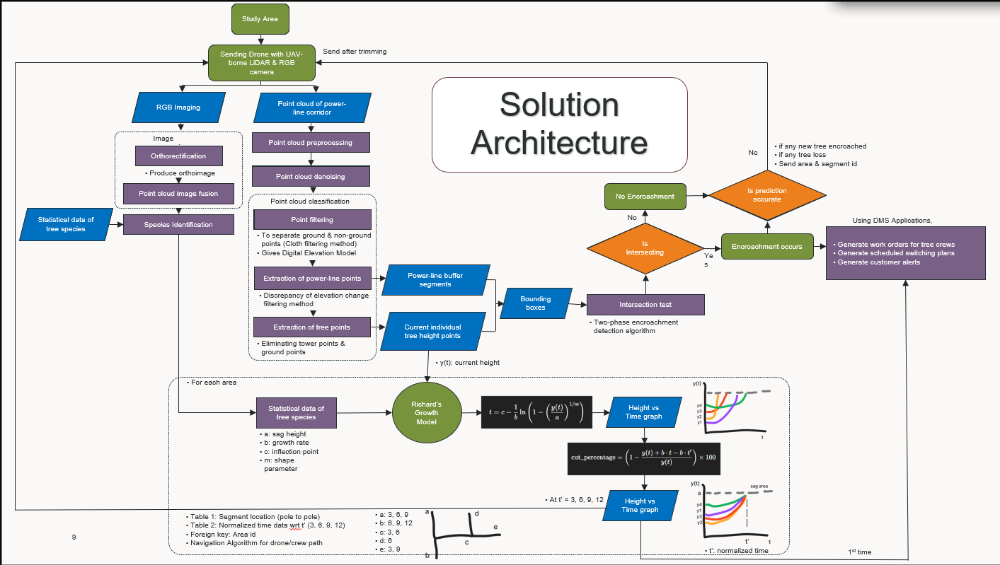
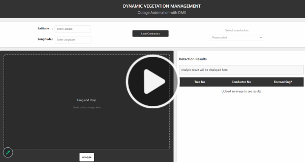

# Dynamic Vegetation Management

Dynamic Vegetation Management (DVM) is a Python and Flask prototype for identifying vegetation encroachment near electrical conductors. It combines image-based AI detection with a local conductor-location dataset to help utility teams identify potential clearance risks before they become outages or safety hazards.

The solution replaces reactive manual inspections and fixed trimming schedules with a predictive, data-driven workflow. UAV data, AI analysis, growth forecasting, and utility operations are connected so crews can address vegetation risks before they cause outages, wildfire hazards, or safety incidents.

**Category:** New Solution. DVM modernizes vegetation management by integrating predictive analytics with existing utility workflows.

## Current Prototype Features

- Upload a vegetation-corridor image through a browser interface.
- Detect trees and power lines with a Roboflow inference workflow.
- Evaluate tree and conductor bounding boxes to identify possible encroachment.
- Load conductor details from a local CSV file using latitude and longitude.
- Display detection results and save annotated output images in `processed_image/`.
- Generate a six-digit simulated Non-Outage Event reference and operation-note message when encroachment is detected.

> The current prototype does not create real NMS events or operation notes. It displays the event message for demonstration purposes.

## Idea Summary

DVM is an AI and UAV-powered predictive-maintenance framework for vegetation near power lines. Drone-based LiDAR and RGB imagery provide 3D geometry, colour, and texture information. The solution processes that information to identify vegetation and conductors, forecast growth, flag potential encroachments, and support operational action through NMS workflows.

## Problem Statement

Vegetation growth is a major contributor to power outages and wildfire risk. Conventional vegetation-management programmes rely on manual inspections and fixed trimming cycles. Manual inspection is costly, slow, and can expose personnel to risk; fixed schedules can lead to over-trimming in some locations and missed threats in others. Without predictive capability, utilities often react after a failure instead of preventing it.

## Proposed Solution

DVM combines UAV-borne LiDAR, RGB imaging, AI and machine-learning analytics, growth prediction, and NMS integration. It detects vegetation threats early and provides the information needed to plan trimming and operational work before clearance becomes critical.

## Solution Workflow

### Data Acquisition Using UAVs

UAVs equipped with LiDAR sensors and RGB cameras capture detailed vegetation and power-line-corridor data. LiDAR produces dense 3D point clouds for spatial geometry, while RGB imagery provides colour and texture for vegetation classification.

### Data Fusion and Preprocessing

RGB imagery is orthorectified to create accurate orthoimages and fused with LiDAR point clouds to combine spectral and spatial information. Preprocessing applies denoising and cloth filtering to distinguish ground from non-ground points and generate Digital Elevation Models. Elevation-change filtering then extracts conductor points and isolates tree points by removing tower and ground clutter.

### Vegetation Analysis and Encroachment Detection

AI and ML models identify tree species and estimate individual tree heights from RGB and LiDAR data. The system generates bounding boxes for trees near conductors and applies a two-phase intersection test against power-line buffer zones. Trees that intersect these safety corridors are automatically flagged as encroachments.

### Predictive Growth Modelling

Richard's Growth Model forecasts future vegetation height using sag height, growth rate, inflection point, shape parameter, and current tree height. The output includes height-versus-time projections for 3, 6, 9, and 12 months, enabling the utility to predict future encroachments and calculate cutting percentages that keep vegetation below conductor sag thresholds.

### Dynamic Work Order Scheduling and Routing

The solution uses a Segment Table for pole-to-pole information and a Normalized Growth Table for predictive-growth information. Both tables are linked by Area ID for scalability. A navigation algorithm uses these records to optimize UAV inspection paths and vegetation-crew travel, reducing redundant visits, fuel use, and time in the field.

### NMS Integration for Operational Execution

For confirmed encroachments, the target workflow creates a Non-Outage Event with operation notes, displays a tree-encroachment symbol in the NMS viewer, generates vegetation-crew work orders, and prepares switching sheets through Suggested Switching. Customer alerts can be initiated when service disruption is expected.

### Feedback and Continuous Learning

Inspection and trimming outcomes are used to validate predictions. New encroachment observations and natural-loss data update the growth models, creating a closed-loop system that improves accuracy over time.

## AI Enhancements

- **Tree classification:** RGB and ML models identify vegetation species.
- **Predictive growth modelling:** Richard's Growth Model forecasts clearance risk.
- **Dynamic scheduling:** Trimming plans adapt to the latest risk data.
- **Optimal routing:** Navigation algorithms reduce inspection and crew travel effort.
- **Self-correcting predictions:** New UAV data retrains models when forecasts differ from field results.

## Key Benefits

- **Accuracy and safety:** Identify encroachments before they lead to outages or wildfires.
- **Proactive maintenance:** Replace reactive cutting with risk-based vegetation management.
- **Operational efficiency:** Streamline work orders, switching sheets, and field workflows.
- **Cost savings:** Reduce unnecessary trimming and redundant site visits.
- **Sustainability:** Optimize routing to reduce fuel use and carbon emissions.
- **Scalability:** Use Area ID-linked data to expand across regions, circuits, and terrain.

## Solution Architecture

This video explains the proposed DVM architecture, from UAV data acquisition and AI-based encroachment analysis through NMS-supported utility operations.

[](https://drive.google.com/file/d/1NVbWYPICdEStLoe0cbdV5w4uCP7ffdOA/view?usp=drivesdk)

Select the image to play the solution architecture explanation.

## Technology Stack

- Python 3.12+
- Flask
- OpenCV and NumPy
- Roboflow Inference SDK
- Pandas, Matplotlib, and Tabulate
- HTML, CSS, and JavaScript
- CSV-based conductor lookup

## Project Structure

```text
.
|-- app.py                       # Flask application and analysis workflow
|-- conductors_location.csv       # Conductor location and metadata dataset
|-- Images Coordinates.docx       # Image-coordinate reference document
|-- templates/                    # Web interface
|-- static/                       # JavaScript and styling
|-- uploads/                      # Source inspection images
|-- processed_image/              # Annotated analysis images
`-- requirements.txt              # Python dependencies
```

## Getting Started

### 1. Clone the repository

```bash
git clone https://github.com/Khoushick-S/Dynamic-Vegetation-Management-with-DMS-integration/
cd "Dynamic Vegetation Management"
```

### 2. Create and activate a virtual environment

Windows PowerShell:

```powershell
python -m venv .venv
.\.venv\Scripts\Activate.ps1
```

macOS/Linux:

```bash
python3 -m venv .venv
source .venv/bin/activate
```

### 3. Install dependencies

```bash
python -m pip install -r requirements.txt
```

### 4. Configure environment variables

Create a `.env` file in the project root and set your Roboflow API key:

```text
ROBOFLOW_API_URL=https://detect.roboflow.com
ROBOFLOW_API_KEY=replace_with_your_roboflow_api_key
ROBOFLOW_WORKSPACE=innovationewnms
ROBOFLOW_WORKFLOW_ID=custom-workflow
UPLOAD_FOLDER=uploads
PROCESSED_FOLDER=processed_image
CONDUCTORS_CSV=conductors_location.csv
HOST=127.0.0.1
PORT=5000
FLASK_DEBUG=true
```

Never commit `.env` to GitHub.

### 5. Run the application

```bash
python app.py
```

Open [http://127.0.0.1:5000](http://127.0.0.1:5000) in your browser.

## How to Use

1. Enter the latitude and longitude for the inspection location.
2. Select **Load Conductors** and choose a conductor from the list.
3. Upload an image of the vegetation corridor.
4. Select **Analyze**.
5. Review the tree/conductor results and the analysis message.

## Environment Variables

| Variable | Purpose |
| --- | --- |
| `ROBOFLOW_API_URL` | Roboflow inference endpoint. |
| `ROBOFLOW_API_KEY` | Your Roboflow API key. |
| `ROBOFLOW_WORKSPACE` | Roboflow workspace name. |
| `ROBOFLOW_WORKFLOW_ID` | Roboflow workflow ID. |
| `UPLOAD_FOLDER` | Folder for uploaded images. |
| `PROCESSED_FOLDER` | Folder for annotated images. |
| `CONDUCTORS_CSV` | Path to the conductor CSV. |
| `HOST` | Flask host address. |
| `PORT` | Flask port. |
| `FLASK_DEBUG` | Enables Flask debug mode when set to `true`. |

## Execution and Output

The intended solution provides dashboard and map views of risk zones, flagged trees, and growth predictions. It produces normalized growth projections for 3, 6, 9, and 12 months, NMS event and work-order information, switching-sheet support, customer-alert inputs, and recommended UAV and crew routes.

## Technologies Used

- **LiDAR and RGB sensors:** UAV-based 3D vegetation and corridor mapping.
- **Python:** Data preprocessing, point-cloud analysis, and workflow automation.
- **TensorFlow and PyTorch:** AI model training for tree detection and classification.
- **OpenCV:** Image processing, segmentation, and bounding-box creation.
- **GIS tools:** Spatial visualization of encroachment zones.
- **Table-driven navigation algorithms:** Efficient UAV and crew routing.
- **NMS integration:** Event, work-order, switching, viewer, and notification workflows.

## Business Value

- **Cost savings:** Reduces manual inspection and unnecessary trimming costs.
- **Grid reliability:** Helps prevent vegetation-related outages and wildfire events.
- **Operational excellence:** Automates field-workflow inputs and shortens maintenance cycles.
- **Regulatory assurance:** Supports transparent, auditable vegetation-management compliance.
- **Sustainability:** Reduces truck rolls and fuel use through optimized UAV and crew operations.
- **Enterprise scalability:** Area ID-based models support expansion without re-engineering.
- **Future readiness:** Continuous learning improves prediction quality over time.

## Demo Walkthrough

Select the thumbnail to watch the DVM prototype walkthrough, including conductor loading, image analysis, and encroachment results.

[](https://drive.google.com/file/d/1AJLSB5jb5zHPxYh4UHID53CqC2czSUmZ/view?usp=drivesdk)

## Important Data and Security Notes

- Never publish `.env` or API keys.
- Validate data publication and operational use against applicable utility safety and data-governance requirements.

## License

This project is licensed under the [Apache License 2.0](LICENSE).

Copyright 2026 Khoushick S. See [NOTICE](NOTICE) for attribution details.
